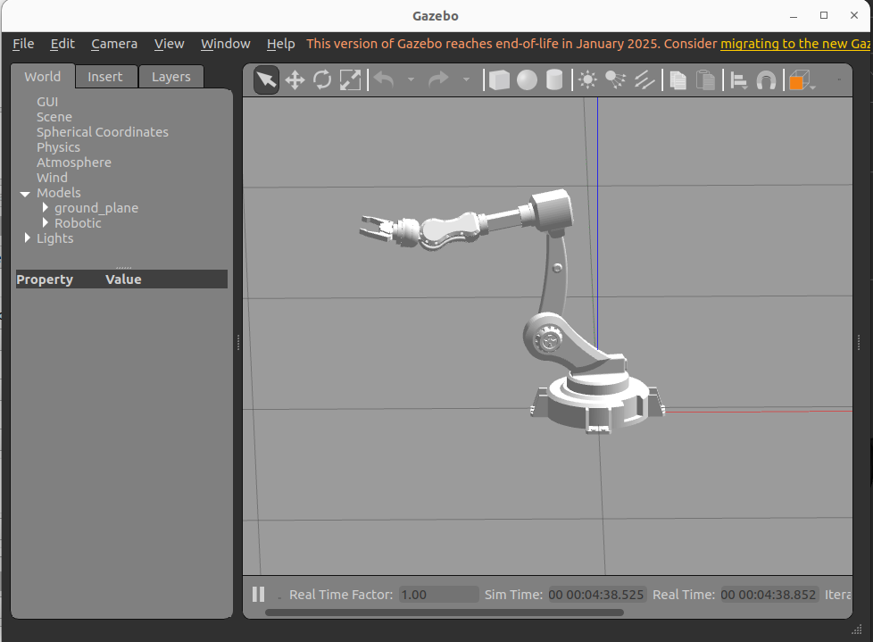
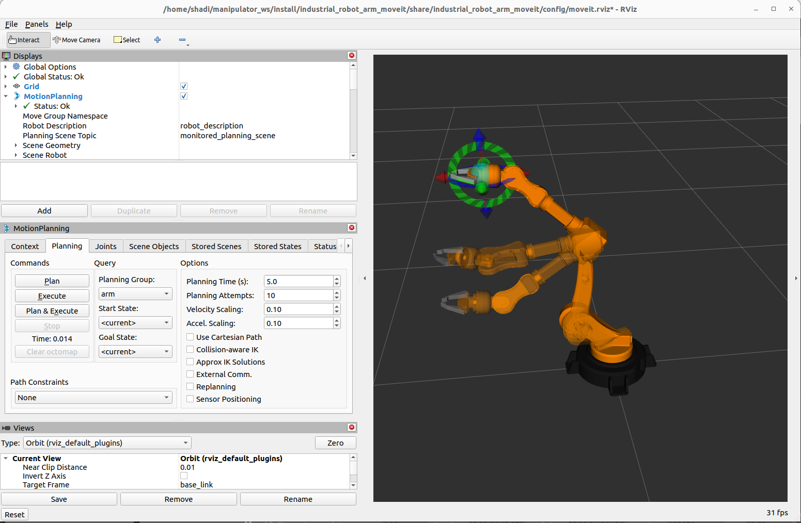

# Custom Robot Arm

A ROS 2 Humble workspace for simulating and controlling a custom industrial robotic manipulator.

This project includes the robot description (URDF), MoveIt 2 motion planning configuration, Cartesian motion planning examples, and joystick-based teleoperation.

## Features

- Custom industrial robot arm model
- URDF-based robot description
- MoveIt 2 integration for motion planning
- Cartesian trajectory planning examples
- Joystick teleoperation
- ROS 2 launch files for simulation and visualization

## Repository Structure

```
custom_robot_arm/
├── src/
│   ├── industrial_robot_arm/          # Robot description and core package
│   ├── industrial_robot_arm_moveit/   # MoveIt 2 configuration
│   ├── manipulator_3dof/              # 3-DOF manipulator package
│   ├── moveit2_cartesian_demo/        # Cartesian motion planning examples
│   └── robot_joystick_control/        # Joystick teleoperation
```

> The `build`, `install`, and `log` directories are generated automatically by `colcon` and are not intended to be version controlled.

## Requirements

- Ubuntu 22.04
- ROS 2 Humble
- MoveIt 2
- colcon
- RViz2
- Gazebo (optional)

## Building

Clone the repository inside your ROS 2 workspace:

```bash
cd ~/manipulator_ws/src
git clone https://github.com/shadidaana/custom_robot_arm.git
```

Build the workspace:

```bash
cd ~/manipulator_ws
colcon build
source install/setup.bash
```

## Running the Simulation

Source the workspace:

```bash
source ~/manipulator_ws/install/setup.bash
```

Launch the robot in Gazebo together with MoveIt 2:

```bash
ros2 launch industrial_robot_arm_moveit robot_gazebo_launch.py
```

This launch file starts the robot simulation and loads the MoveIt 2 configuration for motion planning.

```

### Joystick Control

```bash
ros2 launch robot_joystick_control <launch_file>.launch.py
```

## Packages

| Package | Description |
|----------|-------------|
| industrial_robot_arm | Robot model, URDF, meshes, and launch files |
| industrial_robot_arm_moveit | MoveIt 2 configuration package |
| manipulator_3dof | Three-degree-of-freedom manipulator |
| moveit2_cartesian_demo | Cartesian trajectory planning examples |
| robot_joystick_control | Joystick teleoperation |

## Screenshots




## Future Work

- Collision avoidance
- Pick-and-place demonstrations
- Camera integration
- ROS 2 Control support
- Hardware interface
- Motion planning benchmarks

## License

MIT License

## Author

**Shadi Daana**

Mechatronics Engineer | Robotics | Embedded Systems | Autonomous Systems

GitHub: https://github.com/shadidaana
